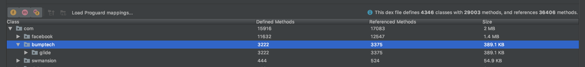
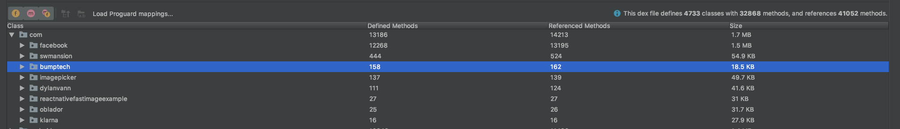

# Glide To Fresco

For many project based on react native is common to use Fresco library. 

Glide and Fresco providing almost the same functionality. BUT...

## BUT...

### 1. Android Methods count problem

DEX file has limit: 65565 methods. If your code has more methods - you will need a multidex approach.

Multidex is always associated with `fat` and `slow` applications that most users does not like. In 
addition multidex approach is quite tricky when you try to optimize it.   

### 2. Glide vs Fresco

Glide costs: 3222 methods / 389Kb



Glide To Fresco Adapter costs: 158 methods / 19Kb



## Solution

In sample I include extra adapter-library that allows to optimize solution and redirect all 
`fast image` calls to glide library to Facebook Fresco alternative.

### How to enable Glide-To-Fresco in sample? 

Connect phone or start emulator and than execute (don't forget to start Metro bundler in addition): 

```bash
# cd ReactNativeFastImageExample/android
./gradlew clean assembleDebug installDebug -P-PUSE_GLIDE_TO_FRESCO=true
```

OR modify file `ReactNativeFactImageExample/android/gradle.properties` file: 

```text

# Set to `true` if you want a replacer for Glide library by Fresco lib provided by React Native/ Facebook.
USE_GLIDE_TO_FRESCO=true
```

Enjoy!